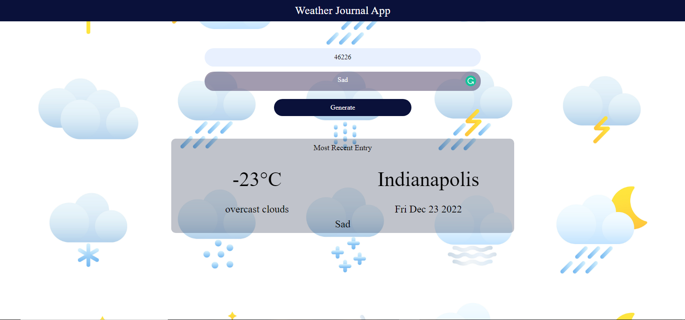

  <a href="" rel="noopener">

 
<h3 align="center">weather-journal</h3>

 
The project is a weather-journal. It's made from the open weather global API. the project is not based only on the logic of fetching an API but rather has a lot of ui features that makes it more appealing for commercial use. the adds that can be put to this project can't be counted, so if you want to add on it then open a merge request and let us see your beautiful contribution.
      

## 🧐 About 

The project is aimed to imitate weather apps that exist in the market. It adds a pretty interface that can be used freely. the logic is using the fetch promises to make the api work on the server and make beautiful results.
## 🏁 Getting Started 
These instructions will get you a copy of the project up and running on your local machine for development and testing purposes. See [deployment](#deployment) for notes on how to deploy the project on a live system.

- click npm i to download all the necessary node_modules needed for this project.
- click node serveer.js to start the local server on port 4000.
- go to the localhost followed by the port to see the project.

### Prerequisites

you need these packages to run the server successfully.

- express.
- cors
- pre-installed latest node-version

### Installing
- npm install.
- node server.js
## ⛏️ Built Using 

- [Vanilla js](https://www.javascript.com/) - programming language
- [Express](https://expressjs.com/) - Server Framework
- [NodeJs](https://nodejs.org/en/) - Server Environment

## ✍️ Authors 

- [@Sara-mabrouk](https://github.com/Sara-mabrouk) 

